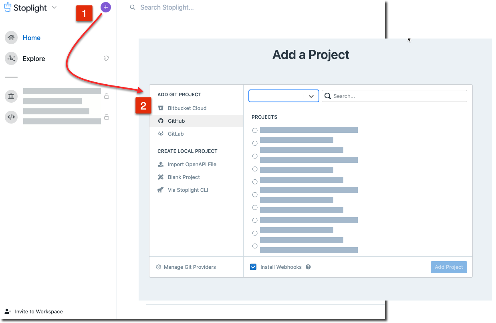
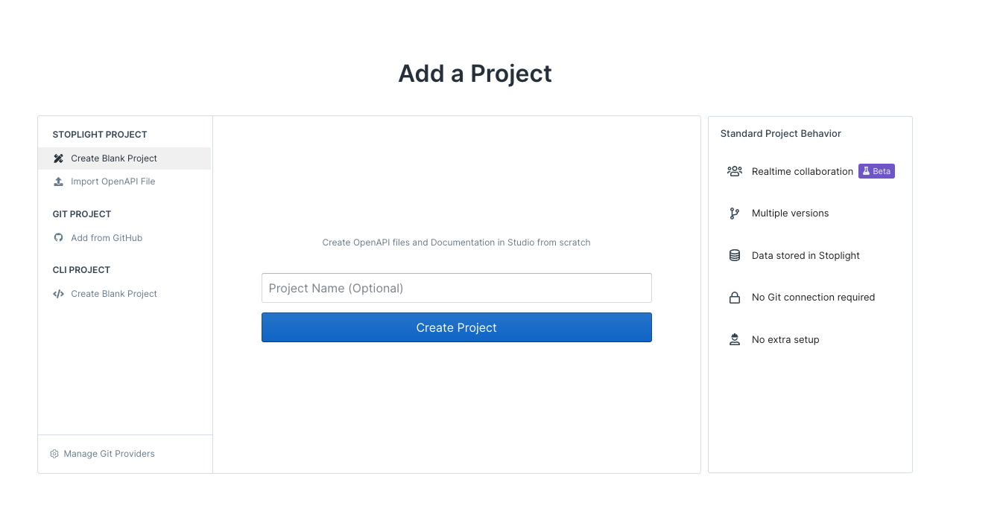
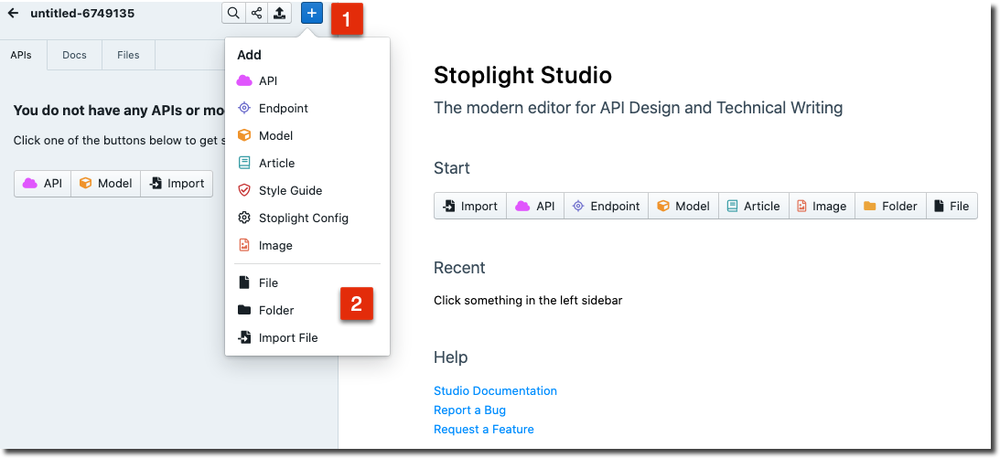
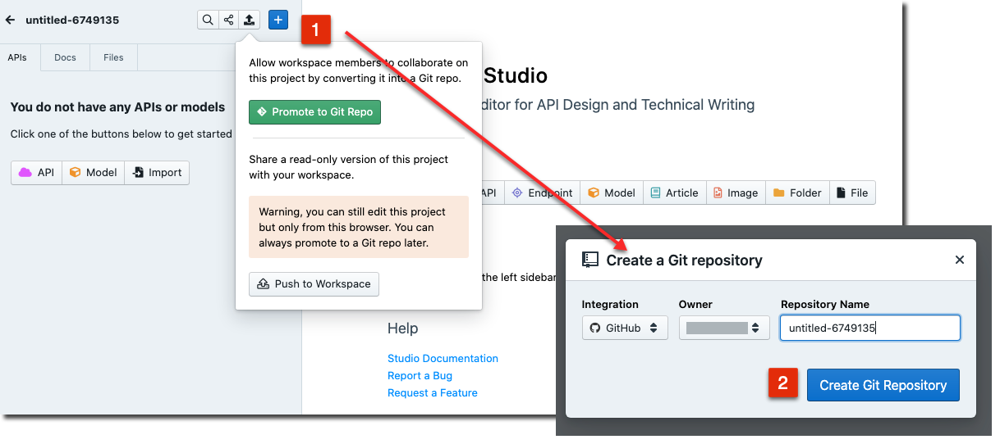
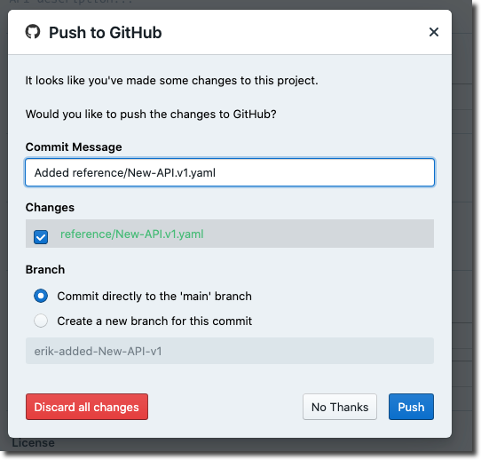
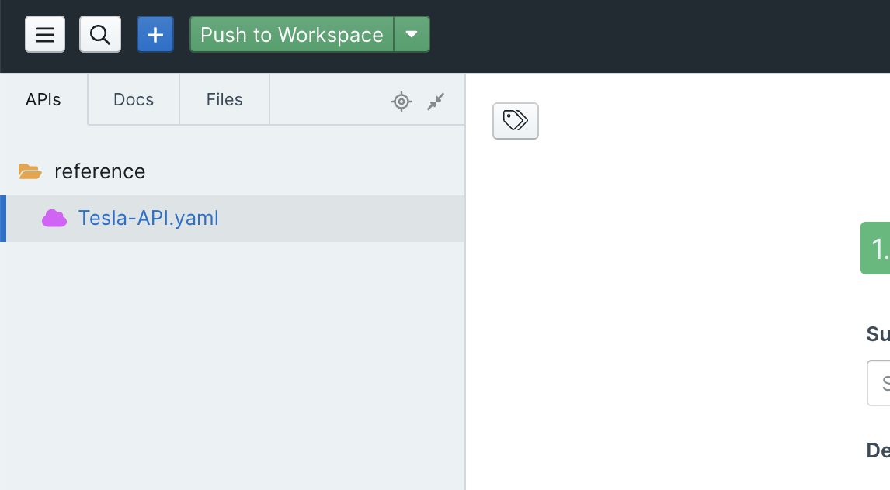

# Add Projects

Projects can contain anything you would expect to find in a repository: source code, API descriptions, images, Markdown articles, maybe some Excel spreadsheets. Stoplight will analyze the contents of a project looking for things it knows what to do with, and ignore the rest.

Stoplight looks for: 

- API Description Documents (OpenAPI v2, OpenAPI v3, and JSON Schema)
- Markdown articles
- Images

## Connect an Existing Git Project

The quickest and recommended way to get projects into Stoplight is to pull them in from Git.

1. Select **+** on the top left, then click **Add Git Project**.

2. Select your Git provider of choice and then click **Connect with Your Git Provider**. Follow the instructions on the pop-up screen to authenticate.
3. Upon successful authentication, you should see your organizations listed. Choose the organization and select the repositories you want to import. Click **Add Projects**.

If the repository has Markdown articles or API descriptions, then you will see them show up.

Next, lets [share this project](share-documentation-quickstart.md). 

## Create a Blank Project/Import Local Files

If you don't have your API artifacts like OpenAPI or JSON Schema on a Git repository or want to get started with creating a new one, you can get started in Studio. 

<!-- theme: warning -->

> ### Warning! 
>
> This project will only be editable via the current browser. If you need to edit on multiple browsers or collaborate with others, please promote to a Git project.

1. Select **+** on the top left, then click **Create Local Project**.

### Import Existing Files and Create new API Descriptions or Documentation

From within studion - Click **+ (ADD)** to Import existing OpenAPI descriptions, JSON Schemas, Images, or Documentation.

Play around, design, and edit using the intuitive interface.  

### Promote to a Git repo (Recommended)
To start sharing this project you can promote it to a Git repository. This would create a Git repo and push the imported/newly created content always keeping it in sync with the changes within or outside Studio. 

Click **Push**, then click **Promote to  Git repo**. 

Choose your desired Git provider, organization, and name and click **Create Git Repository**.

<!-- theme: warning -->

> ### Warning! 
>
> After making change within Studio please ensure you commit changes so nothing is lost. Click **Push** and follow prompts

 

Next, lets [share this project](share-documentation-quickstart.md). 

### Push to workspace

If you don't want to push this content to a Git repo, you can push it to the workspace to start sharing it.

Give it a useful name. Click **Push**, then click **Push to workspace**. 

Next, lets [share this project](share-documentation-quickstart.md). 
