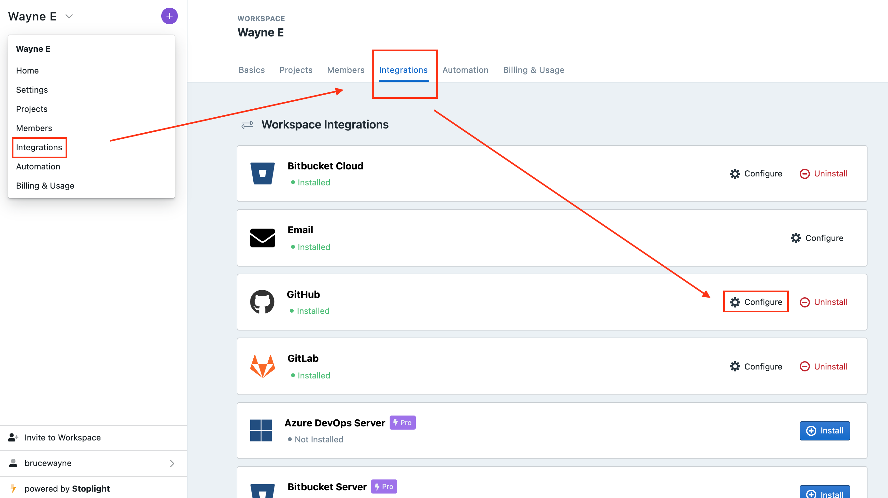
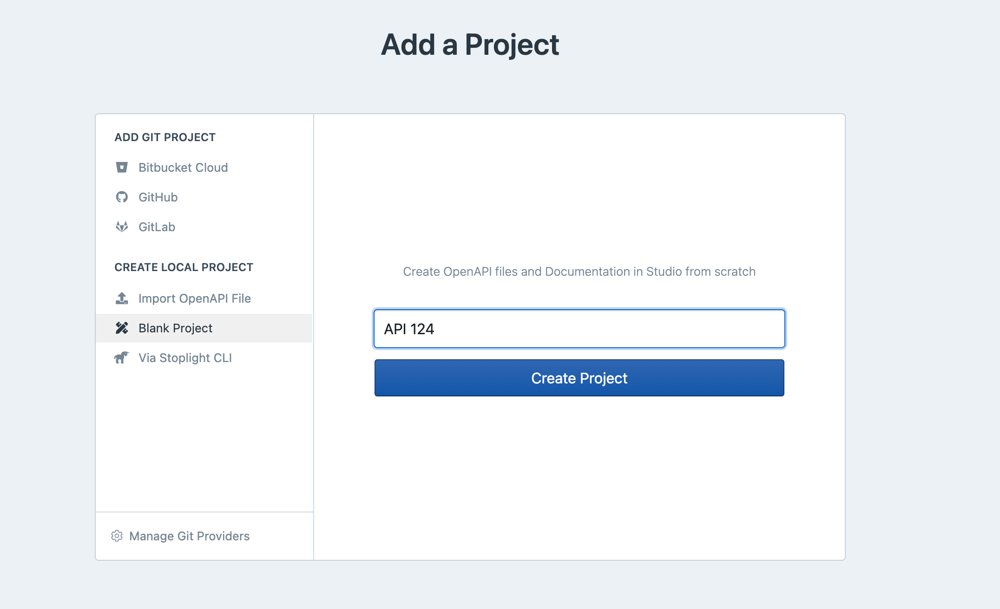
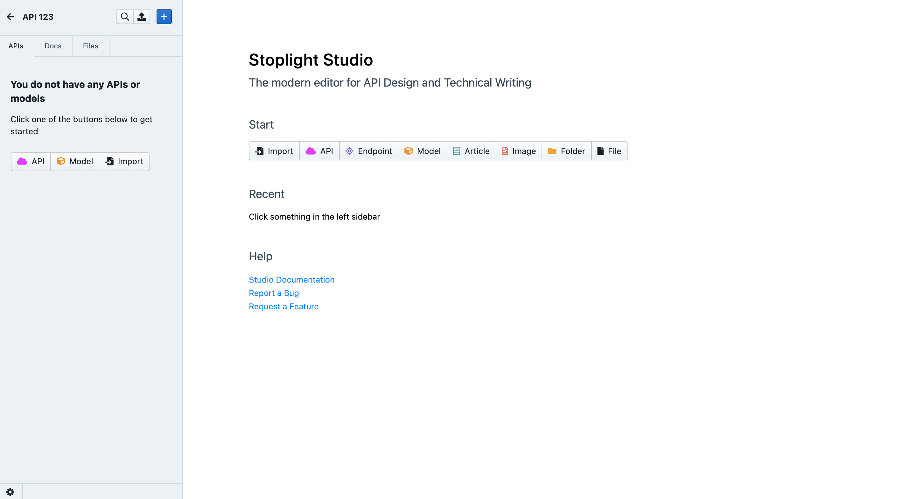
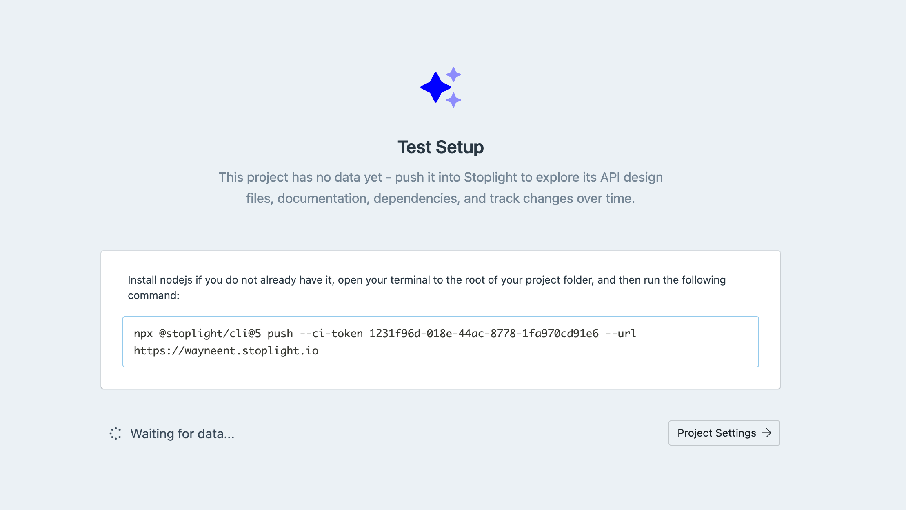
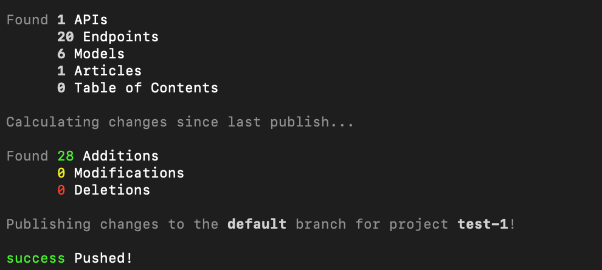

# Add Projects

**Projects** in Stoplight, are a place for you to manage APIs, articles, and any other files that you want to store together.

Projects can contain anything you would expect to find in a repository: source code, API descriptions, images, Markdown articles, maybe some Excel spreadsheets. Stoplight will analyze the contents of a project looking for things it knows what to do with, and ignore the rest.

Stoplight looks for:

- API Description Documents (OpenAPI v2, OpenAPI v3, and JSON Schema)
- Markdown articles
- Images

## Adding Projects on Stoplight

There are multiple ways you can add projects to your Stoplight workspace. Choose the flow that best works for you. We recommend that you get projects into your workspace via **Git**. The methods include: 

1. **Add via Git** 
2. **Create Blank Project**
3. **Import OpenAPI**
4. **Stoplight CLI**

## 1. **Add via Git**

To add a project from your Git repo: 

1. From your **Dashboard,** click the **+** ( add project) button next to your workspace name. 
2. Next click on the Git provider of your choice. 

> **Note:** If your Git provider is already connected proceed to step 3, else see how to set up your Git account:  **Connected Accounts**

3. Upon successful authentication, you should see your organizations listed. Choose your desired organization and select the repositories you want to import. Click **Add Project** when you are done. 

Once the repository data has been analyzed, your workspace home screen should now contain projects populated with data.

### **Custom configuration for Git**

Sometimes you may want to make custom configurations to your Git connection. To do that:

1. Click on **Manage Git Providers** button on the **Add projects** page, or the **Integrations** section in your workspace settings.

2. Click **Configure** in front of the Git provider you're looking to set up a custom configuration for.

3. Select **Customize integration settings** and add your desired configuration. Test it out by clicking `Test Settings`. Press `Save`. 

> **Note**: Custom Integrations are only available to pro users. Read more about [configuring Git](https://meta.stoplight.io/docs/platform/2.-workspaces/configure-git/a.configuring-git.md).

## 2. Create a Blank Project

Although we recommend you start using Stoplight by connecting a Git repository, at times you may not have your API artifacts like OpenAPI or JSON Schema on your Git repo, or you may want to get started by creating a new project.

 In that case: 

1. From your dashboard, click the **+** (add project) button on top left of your home screen. 
2. Next select **Blank Project.** 
3. Specify a **Project** name. 

  4. Click the **Create Project** button. 

You will then be taken to Stoplight Studio. Our editor for API Design and Documentation. 

> **Warning:** Projects **not connected** to a Git repository will **only** be editable on your browsers. This means that you could potentially lose the ability to edit your project when you lose your session data.

If you either need to edit your content on multiple browsers or collaborate with others, it is strongly recommended that you [**promote your project to git**](https://meta.stoplight.io/docs/platform/2.-workspaces/configure-git/a.configuring-git.md).

## 3. Import an OpenAPI Spec:

If you have your API in the form of OpenAPI on your local storage, you can easily import it to Stoplight. To do that: 

1. Navigate to **Import OpenAPI** F**ile** on the Add project page. 

  2. Specify a **name** for the project. 

  3. Choose the **project folder** from local storage. 

  4. Clicking upload or open. 

**It's that simple. Your Project is on Stoplight, you can now start editing it.** 

> **Note:** To learn how to best work with Stoplight, view our detailed guides on: 
> * [**API Design**](https://meta.stoplight.io/docs/studio/docs/Design-and-Modeling/01-getting-started.md) 
> * [**API Documentation**](https://meta.stoplight.io/docs/studio/docs/Documentation/01-getting-started.md)
> * [**Stoplight Studio**](https://meta.stoplight.io/docs/studio/README.md)

## 4. Stoplight CLI

Another point of entry into the Stoplight Universe, is through the **Stoplight CLI**. Stoplight CLI is a command-line tool, built as an NPM module, which can publish changes to Stoplight, and have them show up in **Explorer** just like any other project. 

**Stoplight CLI** is designed for those who use a different version control system other than Git. 

If you make use of Mercurial, SVN, SourceSafe, Bazaar or another service to keep your work organized, Stoplight has you covered.

> **Note:** Projects you add through CLI won't be editable in Studio, but the content will be available to read and search like anything else. 

1. Navigate to the **Add Projects** section and click on via **Stoplight CLI.**
2. Give this project a name, and click **Add Project**. This is going to create an empty project where you can  push data.
3. Copy the **command** on the screen.

4.  Open your terminal, navigate to the root folder of the project and **run this command**. This will push data to your project. 

5. You can then view the project in our **Explorer.** Read more about [working with local projects](https://meta.stoplight.io/docs/platform/2.-workspaces/f.working-with-local-projects.md).

> **Tip:** You can add this command to your Continuous Integration server to update the contents whenever something changes.

6. It's important to remember that projects imported via **Stoplight CLI** are **read only** and cannot be edited on Stoplight. 

# **What's Next:**

Now that your projects are setup, you can move onto the next steps in your API design and documentation journey: 

- **Promote to Git**
- **Project Settings**
- **Share documentation**