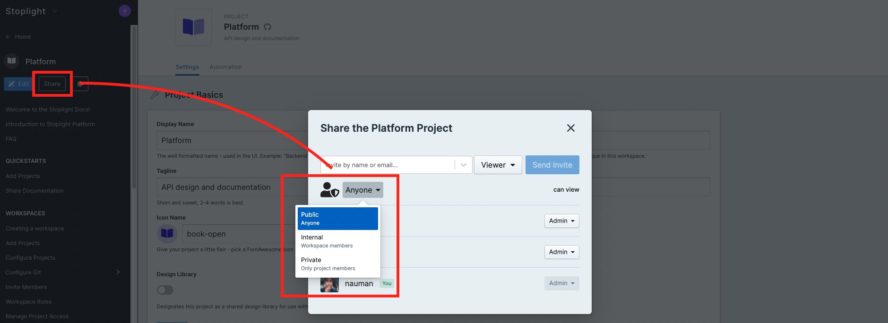

# Sharing Documentation

With your project added to Stoplight, you are now ready to share your API documentation. You can think of your [workspace](./../2.-workspaces/a.creating-a-workspace.md) as a developer hub, which can be viewed by either authenticated or anonymous users depending on your project visibility settings.

## Managing Project-Level Access

To update the project visibility or add users to a project, navigate to the **Manage Access** tab in the project settings screen (using the cog icon next to **Edit in Studio**). From this screen, you will be able to modify the visibility settings of a project

> Keep in mind that users will see different projects depending on the following criteria:
> - Their permissions in the **workspace**, or
> - Their permissions in the **project**, or
> - The **visibility settings** of the project (private, public, or internal)

### Public Documentation

Set the project visibility as **Public** to allow anyone on the Internet, including anonymous users, to view the project contents.

### Internal Documentation

Set the project visibility as **Internal** to allow everybody logged in as a user of the workspace to view the project. Projects with **Internal** visibility will not be accessible to unauthenticated users.

### Private Documentation

Set the project visibility as **Private** to restrict access only to users with direct access. Give authenticated users access to the project documentation by adding them under the **Manage Access** tab under the project settings.

## Create a Landing Page

The Home Screen is the landing page for all users coming to the documentation. This can be used to highlight important APIs, getting started guides, or even embed some tutorial videos if you're feeling creative.

There's an example template available to get started quickly. You can edit or completely replace the default template using [Stoplight Flavoured Markdown](https://meta.stoplight.io/docs/studio/docs/Documentation/03a-stoplight-flavored-markdown.md) from the workspace settings.

## Add Company Logo

In the workspace settings, add a URL to your logo. It's recommended to use a logo with the company name. 

## Share with Users

With your landing page ready, and projects set to the correct visibility, **share the link to your workspace with users** to let them access the documentation. For internal team members [invite them](../2.-workspaces/d.inviting-your-team.md) to the workspace. 
