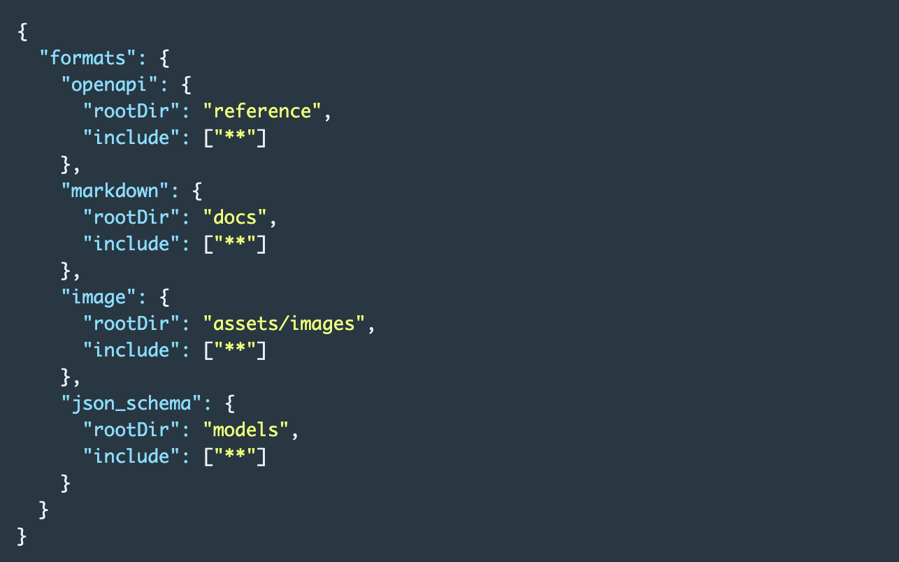
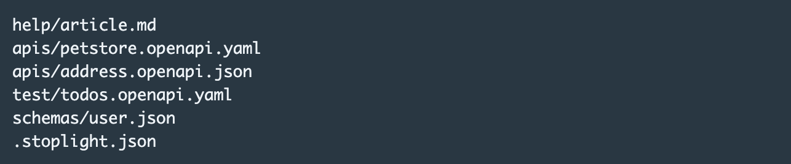
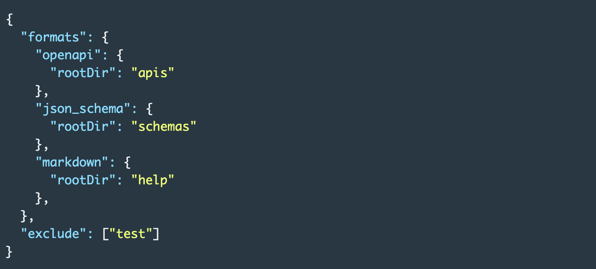
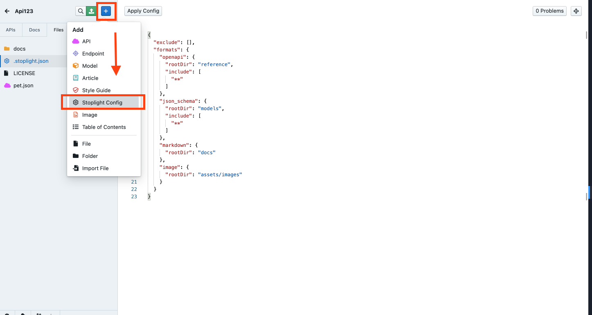

# **Configure Projects**

When you add  **projects** to Stoplight, or associate them with a **Git repo**, Stoplight analyzes the contents of your repository and looks for things like: 

- API Description documents (OpenAPI v2, OpenAPI v3, and JSON Schema)
- Markdown articles
- Images

Seeing that your repos can contain all sorts of files, sometimes you might not want Stoplight to analyze specific files such as developer-only internal documentation. Other times you might want your files grouped into specific folders, instead of  being added to root.

You can limit and control what Stoplight analyzes by using a `".stoplight.json"` config file. 

## What is the `".stoplight.json"`  file?

The `".stoplight.json"` file is a configuration file that should go in the root of your project. It can be regular **JSON** or **JSONC** (i.e. JSON with comments, and trailing commas) file. 

When you create an API in Studio, it will use this configuration to know what files to exclude, and where to put a certain file, so it's not shoved into the root along with everything else.

The configuration file is made up of two key keywords: 

1. `"exclude"` 
2. `"formats"` 

### 1. Exclude:

Any file or directory matching the pattern listed in exclude won't be indexed by Stoplight.

### 2. Formats:

Specifies which files are supposed to be read and parsed as APIs, documentation, or other content.

- `rootDir` (required) - when `include` is unspecified, all files placed under `rootDir` are marked as included. Used by UI wizards in Studio as a default location for certain kinds of files.
- `include` (optional) - at least one pattern needs to match the `rootDir`.

By default a project configuration looks like this: 

Any files with the `openapi` and `json_schema` formats will go under the "APIs" panel, and any files with `markdown` or `images` formats will go under "Docs".

The funny-looking stars in the `"include"` are a [glob](https://en.wikipedia.org/wiki/Glob_(programming)) pattern, for finding files based on a pattern. More specifically, we're using an open-source library called [micromatch](https://github.com/micromatch/micromatch).

# **Example**

Maybe a project has multiple APIs in the  `apis` directory, some test files that should not be indexed, and some models in a `schemas` directory, which you also use for [contract testing](https://apisyouwonthate.com/blog/writing-documentation-via-contract-testing).

To exclude the test files and make it clear which other files are which, the following configuration file could be used:

## Adding a Stoplight Configuration file

To add a configuration file: 

1. From your dashboard, navigate to your project and click **Edit.** 
2. Once when you are inside the Studio, click the **+ (add)** button on the top left corner, then select the **Stoplight Config.** 
3. This will open the default configuration file. 

4. Make your edits, and then click **Push** when done. 

**Congrats. Your projects is now configured to be synchronized, the way you want it! 😊**

## What's Next?

Now that your project is configured, learn how you can: 

- **[Invite Team Members](https://meta.stoplight.io/docs/platform/2.-workspaces/d.inviting-your-team.md)**
- **[Manage Project Settings](https://meta.stoplight.io/docs/platform/2.-workspaces/l.project-roles.md)**
- **[Start working with Stoplight Studio](https://meta.stoplight.io/docs/studio)**
