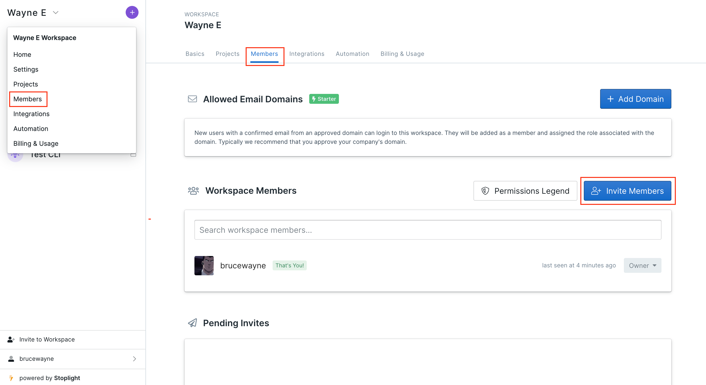
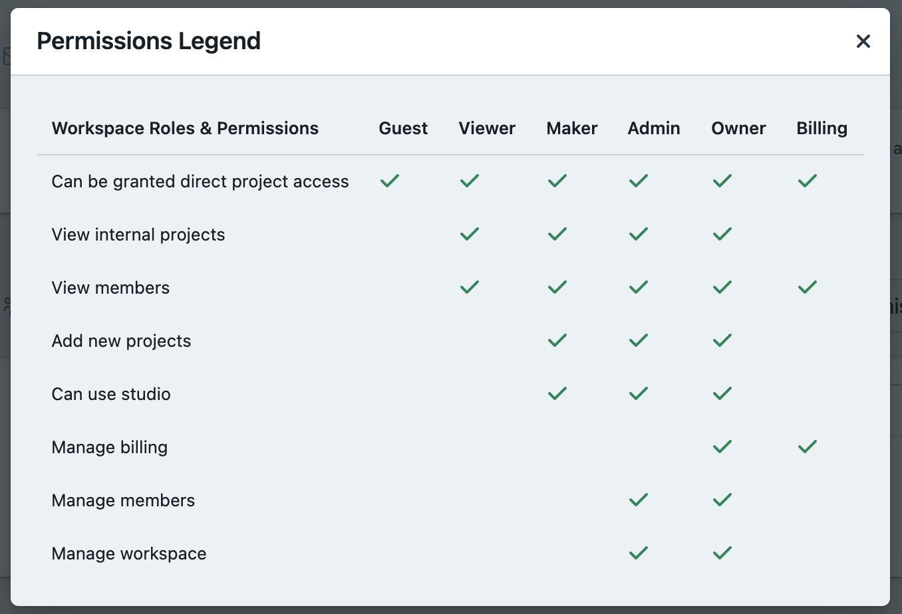

# **Invite Team Members**

The **Stoplight** Platform has been built with a modern API workflow in mind, providing your team with the tools to work on a single platform thought out the API Lifecycle. 

Once you have your **workspace** set up, the next step should be to invite your colleagues and partners to collaborate on API design, view documentation, and access mock servers.

You can invite up to 5 team members on the **Free** and **Starter** plan and more as you scale up. 

## Inviting Team Members to your workspace

1. From your dashboard, click on the **workspace name** on top left of the page. 
2. Next, select **Members** from the dropdown. This will take you to member settings. 

3. Once you are on the member settings page, click **Invite Members.** 

4.  Enter the work **Email Address** of your teammate, select a **Role** and click **Send Invite.** 

Since you would be inviting different stakeholders from different parts of the API Lifecycle, you can limit and restrict, who gets access to what. 

**Note:**  Learn more about organizing your team and assigning roles here: **Workspace Roles.** 

Once you send an invite, your invitation will move to the pending invites section, and your team member will be sent an invite over email. When they click **Accept,** they will be added to your workspace. 

# What's Next?

Now that your team members are on your workspace, you can start collaborating over: 

- **[API Design](https://meta.stoplight.io/docs/platform/3.-design/a.overview.md)**
- **[API Documentation](https://meta.stoplight.io/docs/platform/4.-documentation/a.overview.md)**

