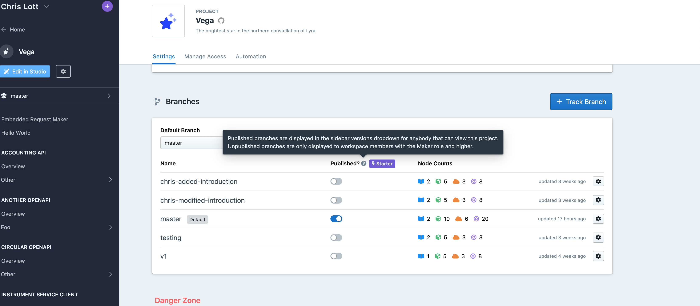
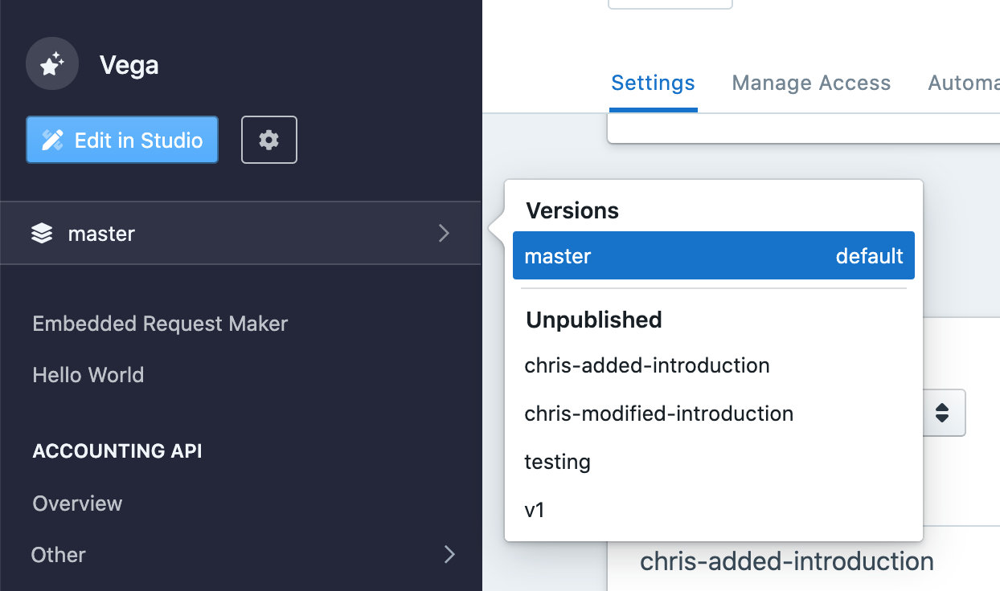
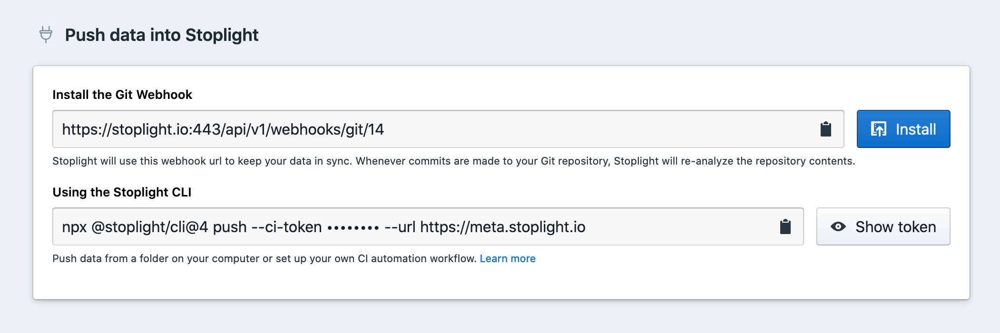

# Branch Management

Projects powered by Git can leverage the awesome power of [Git branches](https://git-scm.com/book/en/v2/Git-Branching-Branches-in-a-Nutshell). 

Sometimes branches are used for versioning, so a repository might have a `v4` and a `v5` branch.

Sometimes branches follow certain "branching models" for common workflows such as [Git Flow](https://www.atlassian.com/git/tutorials/comparing-workflows/gitflow-workflow). These repository will have a `master` and a `develop` branch, along with all sorts of "feature branches" in the format of `feature/adding-a-thing`.

Regardless of the model, there is always a default branch. Branches could be named absolutely anything, but there are some common default branch names used by most of the popular Git providers: `trunk`, `main`, or `master`.

## Publishing Multiple Branches

> This feature is available on the Stoplight **Starter** plan, and above.

The [publishing process](g.automating-publishing.md) updates all sorts of things: Explorer, Documentation, Mock Servers, and Design Library. By default, these things all run off of the default branch, and there is only one default branch, but you can enable more branches for publishing.



When another branch has publishing enabled, you're not going to see it pop up in explorer, mock servers, or the design library (yet? 🤔) but anyone viewing your documentation will be able to pick between branches.



There are two types of branches shown in the versions dropdown:

- **Published branches** (called "Versions") are viewable to everyone including Guest and Viewer roles
- **Unpublished branches** are only viewable to workspace Makers, Admins, and Owners.


## Changing Default Branches

Say you want to switch from `master` to `main` at your organization, which I am doing as I write this documentation. I can do this in Studio or quickly via the CLI in the locally cloned repository for a particular project.

1. Run this command in the terminal to push the master branch up, but give it a new name: `main`.

```shell
git push origin master:main
```

2. Now we have two probably identical branches. Pop over to your project settings to change it.



3. Change the default branch using the dropdown, and you should see a message letting you know the default branch was updated successfully.

4. You will probably need to update your default branch on your repository too:

- [GitHub Cloud Instructions](https://docs.github.com/en/github/administering-a-repository/setting-the-default-branch)
- [GitHub Enterprise Instructions](https://docs.github.com/en/enterprise/2.21/user/github/administering-a-repository/setting-the-default-branch)
- [GitLab Cloud Instructions](https://docs.gitlab.com/ee/user/project/repository/branches/)
- [GitLab Server Instructions](https://docs.gitlab.com/13.1/ee/user/project/repository/branches/index.html)

5. Remove the old branch from your Git repository.

```shell
git push origin :master
```

6. If [webhooks](./g.automating-publishing.md) have been setup then this branch has already been automatically removed from Stoplight. If webhooks are not enabled, you will need to delete the branch from the list by clicking on the cog and clicking the "Remove from Stoplight" button.
