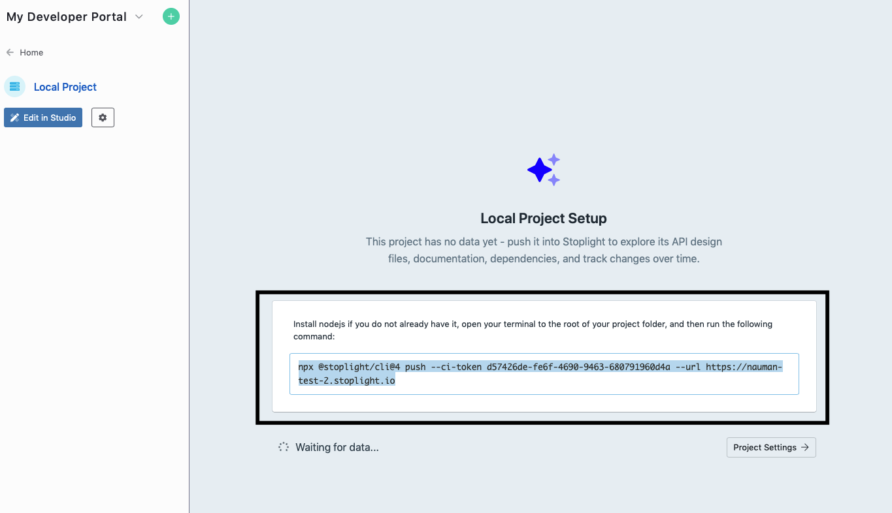

# Shared Models

While designing your APIs, you will often find yourself repeating **structures** in your endpoint request and response bodies. 

**For example:** You might have an API endpoint that returns a list of users, and another endpoint that returns a single user. 

The **response structures** of these two endpoints will be very similar:

1. One will respond with an **array** of user objects. 
2. The other will respond with a **single** user object. 

Now instead of defining those structures multiple times, you can define it once as a **shared model**, and reference it with your request or response bodies. 

This way anytime you have to update the structure, you will just have to do it once, and all instances of it will be updated automatically. 

## Creating a Model

There are two different methods for generating a CRUD model:

- Using the JSON Schema **editor**, which allows you to create data structures in an easy-to-use, graphical format.
- Using the **Raw Schema** editor, if you would prefer to modify the data structure with raw JSON Schema.

**Note:** To dive deeper into creating models, visit our guide: **Working with Models**

## Using a Shared Model

Making use of a model when defining your request and response bodies is very easy. To use a shared model: 

1. Open your project in **Studio,** navigate to an **endpoint** in your **API** file. 
2. In the **endpoint**, you may either want to specify a **request** or a **response** body. 
3. In case you want to add a request body, navigate to the **JSON Request Body** button and click it. 
4. As a result, you'd see the option to add a **Schema** and an **Example.** 
5. Right below the schema, you would see "**object**" mentioned. That is the default schema **type**, to use a shared model, change the type to **$ref.**  

6. And then select a **model** from the dropdown that opens.

7. You can follow the same practice for the the **response** body. 

8. Once done make sure to **save** and **push** changes to Git. 

## **What's next?**

Now that you know how to work with mosrt of the shared components, learn how to use: 

- **Shared Examples**