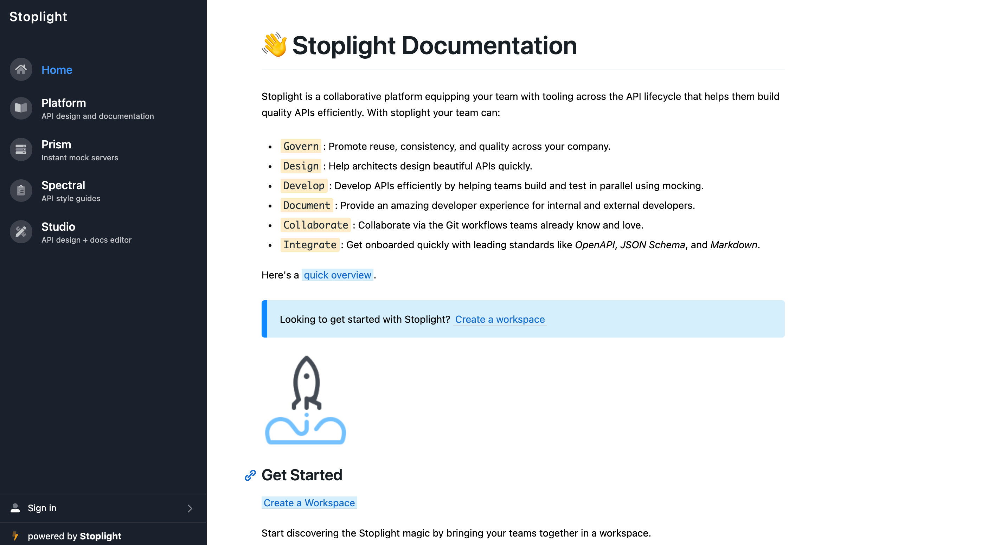
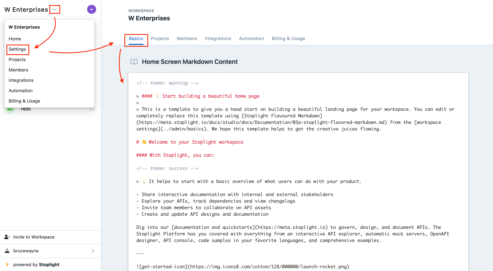

# **Configuring your Stoplight Home Screen**

Your Stoplight **Home Screen** is the landing page for your workspace. It is the first thing users (internal/external) will see when they come to your documentation. 

## **What is a Home Screen?**

Your **Home Screen** is the main landing page for your workspace, it should give a good idea of what your API does, and how to navigate to certain parts of your documentation. Use the **Home Screen** to your advantage by highlighting important artifacts like:

- API Overview
- Getting Started Guides
- Authentication Guides
- Tutorials
- Videos
- FAQs
- Developer Resources (Client Libraries/Sample apps)

A well structured **Home Screen** will be quick to communicate:

👉  **What users can expect from your APIs?**

👉   **How to best make use of them?**

👉  **How to navigate to certain parts of the documentation?**

For reference, here's a glimpse of how we do our **Home Screen** at Stoplight: [https://meta.stoplight.io/](https://meta.stoplight.io/)

On the left, you can see our list of projects, while on the right, the content that goes on the **Home Screen.** 

## Customizing your Home Screen

Customizing your **Home Screen** is very easy. You can structure the page anyway you want in Markdown. There's an example template available to get you started, you either edit it or start completely fresh. 

To start customizing your **Home Screen:**

1. From your Dashboard, click the **Workspace** dropdown. 
2. Select **Settings** > **Basics** and then scroll down to the bottom of the page. 

The **Home Screen** editor makes use of our own special version of Markdown called the **Stoplight Flavored Markdown** or **SMD** for short. ****

**SMD** is an extension of CommonMark adding more advanced features like themable callouts and embedded JSON Schema models. 

- To learn more about SMD protocols visit: [Stoplight Flavored Documentation](https://meta.stoplight.io/docs/studio/docs/Documentation/03a-stoplight-flavored-markdown.md)
- To learn how to best work with Markdown visit: [Using Markdown in Documentation](https://meta.stoplight.io/docs/studio/docs/Documentation/03-markdown-basics.md)

3. When you are done making your edits, click the **Save** button at the bottom. 

> **👉 Note:** There is no live preview for the changes you are going to make. In case you want to see how the page is turning out, you will have to leave the editor and visit your workspace in realtime. 

**That's it! You now have a new Home Screen. 📺**

## **What's Next:**

Once your Home Screen is ready, your workspace is all ready to be shared with your users. Checkout the resources below to discover the next steps:

1. **[Managing Project-Level Access](../../9.-teams/l.project-roles.md)**
2. **[Sharing Workspace with Users](../../1.-quickstarts/share-documentation-quickstart.md)**