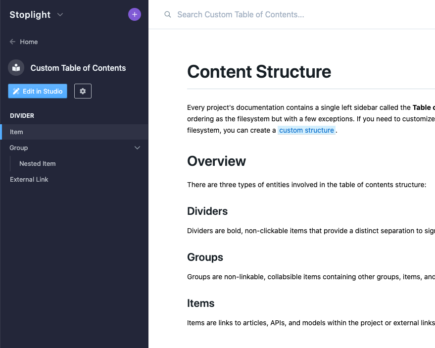

# Table of Contents

Every project's documentation contains a single left sidebar called the **Table of Contents** (or TOC). The [default structure](#default-structure) loosely follows the filesystem, with a few exceptions for APIs and models. If you want to customize how your files are organized, you can create a [custom structure](#custom-structure).


## Overview

There are three types of items in the table of contents structure:

### Sections

Sections are bold, non-clickable items that signify the start of a section of content within the sidebar.

### Groups

Groups are non-linkable, collabsible items containing sections, docs, and other groups that all relate to the same subject matter.

### Docs

Docs are links to articles, APIs, and model files located within the project directory or external links to content outside of the documentation.

## Default Structure

The default structure is organized based on a few factors, such as the file type, but primarily follows the same alphanumeric ordering as the filesystem.

### Articles

Markdown articles come first in the table of contents and are ordered alphabetically by their file path. The first directory is represented as a [section](#sections) and any directories after appear as [groups](#groups). 

There are a few exceptions. If a "docs" folder exists, it is flattened and not represented in the table of contents. Any articles located in the root of the project are sorted to the top. If a "README.md" file exists, it is put in the first position.

### APIs

Next in the list below articles are your APIs. Each API's title is represented as a [section](#sections) followed by an item titled "Overview". The overview item contains the API's description, contact, licensing, servers and global security. 

All of the API endpoints and models are nested inside [groups](#groups) titled after their first tag. Any without tags are placed into a group titled "other". If none of your endpoints or models contain tags, they are placed into groups titled "Endpoints" and "Models" respectively.

### Models

Finally at the bottom of the table of contents are JSON Schema model files, sorted alphabetically under a [section](#sections) titled "Models".

## Custom Structure

<!-- 
theme: warning
-->

> This feature is in private beta. If you would like to join the beta, please [submit a request](https://roadmap.stoplight.io/c/59-completely-custom-ordering-of-your-docs-sidebar) on our public roadmap.

If you want to customize the organization of your project's content structure, you can create a custom table of contents. To get started, create a `toc.json` file in your project's root directory.

### Rules

The `toc.json` file should start off with an empty `items` array where you will define your content structure using [sections](#sections), [groups](#groups) and [docs](#docs).

<!-- title: toc.json -->
```json
{
  "items": []
}
```

Each item should have a `type` and a `title` property. Doc items should also have a `uri` property that either points to a file somewhere within the project or an external link to another website. Groups should have an `items` property allowing you to futher nest more docs, sections and groups.

> **TIP**: The easiest way to get a file's URI in Studio is to click the `...` button next to the file, click the "copy path" menu item then paste the contents.


### Example

Here's a very basic example to demonstrate the format of the `toc.json` file. 

<!--
title: toc.json
-->
```json
{
  "items": [
    {
      "type": "section",
      "title": "Section"
    },
    {
      "type": "doc",
      "title": "Doc",
      "uri": "docs/table-of-contents.md"
    },
    {
      "type": "group",
      "title": "Group",
      "items": [
        {
          "type": "doc",
          "title": "Nested Doc",
          "uri": "docs/nested-doc.md"
        }
      ]
    },
    {
      "type": "doc",
      "title": "External Link",
      "uri": "https://stoplight.io"
    }
  ]
}
```

The above `toc.json` file displays the following structure in the docs sidebar.



### Limitations

There are a few known limitations with the custom table of contents that we are working to address.

1. **You can only reorder articles, APIs, and model files.** Endpoints and internal models will follow the [default structure](#default-structure) described for APIs. If you're interested in customizing your endpints or models, please [vote for this feature](https://roadmap.stoplight.io/c/110-custom-ordering-for-endpoints-and-models).
2. **The `toc.json` file must be written by hand.** We are considering adding a drag & drop editor within Studio to make it easier to create and edit your table of contents, so if you're interested please [vote for this feature](https://roadmap.stoplight.io/c/112-table-of-contents-editor).
3. **Renaming a file does not automatically update the `toc.json` file.** You'll need to remember to update your TOC whenever a file is renamed or your docs sidebar will contain broken links. We are considering automatically rewriting pointers as you change your filenames, so if you're interested please [vote for this feature](https://roadmap.stoplight.io/c/96-automatically-rewrite-references-and-links-on-filename-change).
4. **Renaming a file does not automatically redirect to the new docs url**. This means a filename change will result in a dead link in your docs. We are considering adding automatic redirects, so if you're interested please [vote for this feature](https://roadmap.stoplight.io/c/68-automatic-redirects).
5. **You cannot customize the docs routing structure.** A file's docs url will match it's file path within the project directory. We are considering adding support for customizing the routing structure, so if you're interested please [vote for this feature](https://roadmap.stoplight.io/c/111-custom-docs-routing-structure).

If you have an new idea or would like to make a suggestion, please submit it our [public roadmap](https://roadmap.stoplight.io/tabs/7-under-consideration/submit-idea)!

