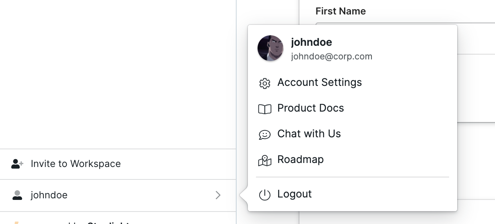
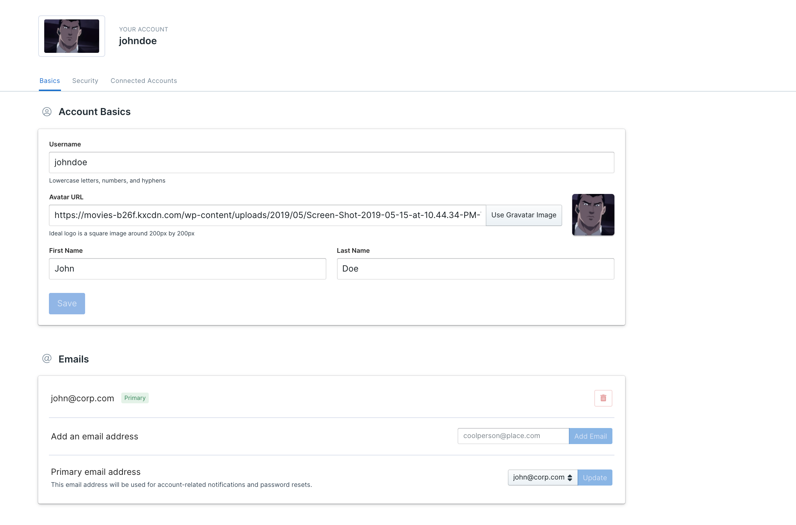
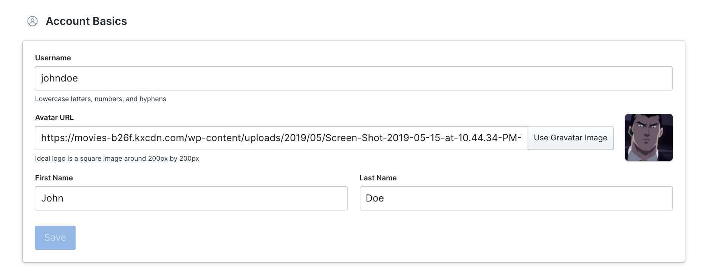
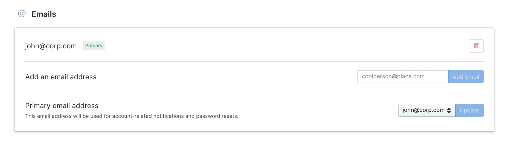
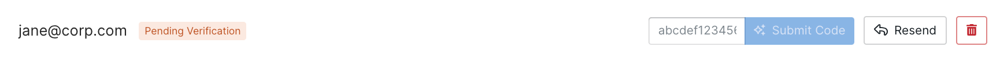
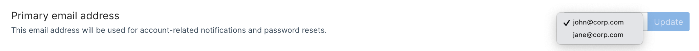
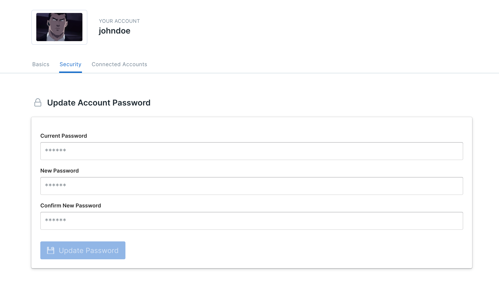
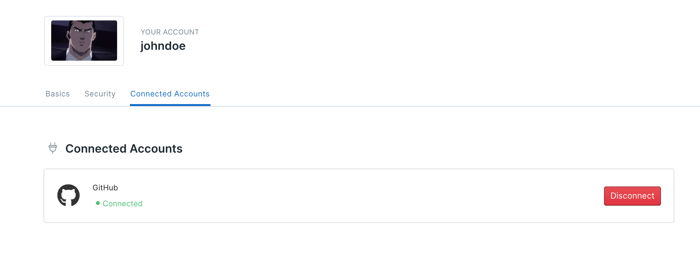

# Account Settings

Adjust your account settings to make Stoplight work best for you. Account settings include: 

1. Account Basics 
2. Emails
3. Security 
4. Connected Accounts

Read on to learn how to update your preferences. 

1. From your **Dashboard**, click the **Account** tile on bottom left. 

2. Next select **Account Settings** from the pop up. 

This will open the **Account Settings** page: 

## 1. Account Basics

Complete your Stoplight profile to make yourself more recognizable to your teammates. With a distinct **Username** and **Avatar,** collaboration becomes really easy. 

1. Add in a **Username**. 

> **Note:** Username has to be unique, in lowercase, and can only include letters, numbers,  and hyphens. 

2. Provide a URL to your **Avatar** image, or just click **Use Gravatar Image** to pick your public avatar. 

3. Edit your **First** and **Last Name** if required. ****

4. Click the **Save** button when you are done making changes. ****

**Congrats! Your profile is all set to go. And now we know what you like 😁**

## 2. Add or Change Email Address

The primary email address associated with your Stoplight account is the one you signed up with, however you can change it upon need. Before you do that, you need to add another email address to your account. 

Scroll to the bottom half of the **Account Settings** page and: 

1. Type in the **Email address** you want to add. 
2. Click **Add Email.** 
3. Following this, we will send you a verification code. Submit code to confirm your new address. 

    

> **Note:** You can have your account associated with multiple addresses at the same time.

3. To change the primary email address, pick an address from the dropdown and click **Update**. 

> **Note:** Your primary email address is used for all account related notifications. 

**You are all set to go. Your primary email address is updated**. 👍

## 3. Security

There are multiple ways to sign into Stoplight. If you want to sign into Stoplight manually, using your email address, you will need your password. You can reset your password anytime under the **Security** section. To do that:

1. Click **Security** on the **Account Settings** page. 
2. Enter your **current password.** 
3. Then your **new password.** 
4. Re-enter to confirm your selection. 
5. Click the **Update Password** button once you are done**.** 

**And that's it. You are good to go. Your account password is updated 🔐**

## 4. **Connected Accounts**

Stoplight lets you connect with popular Git Providers so that you can work directly with projects in your public or private repos. To learn how can you best work with Git repos, visit our **Configure Git** guide. 

To connect your Stoplight account to your Git repos: 

1. Select **Connected Accounts** on the **Accounts Settings** page. 
2. Click **Connect** against the repo of your choice. 

3. Next, fill in the credentials to your git account. 

4. Once the account is connected, the connection status will turn green to show successful completion. 

5. You can disconnect the account anytime, before you do that you would need to see how does that affect your workflow. 

**Your Git account is up! ⚙️**

## What's Next:

1. Adding your Projects 
2. Inviting your Team Members
3. Workspace Theming