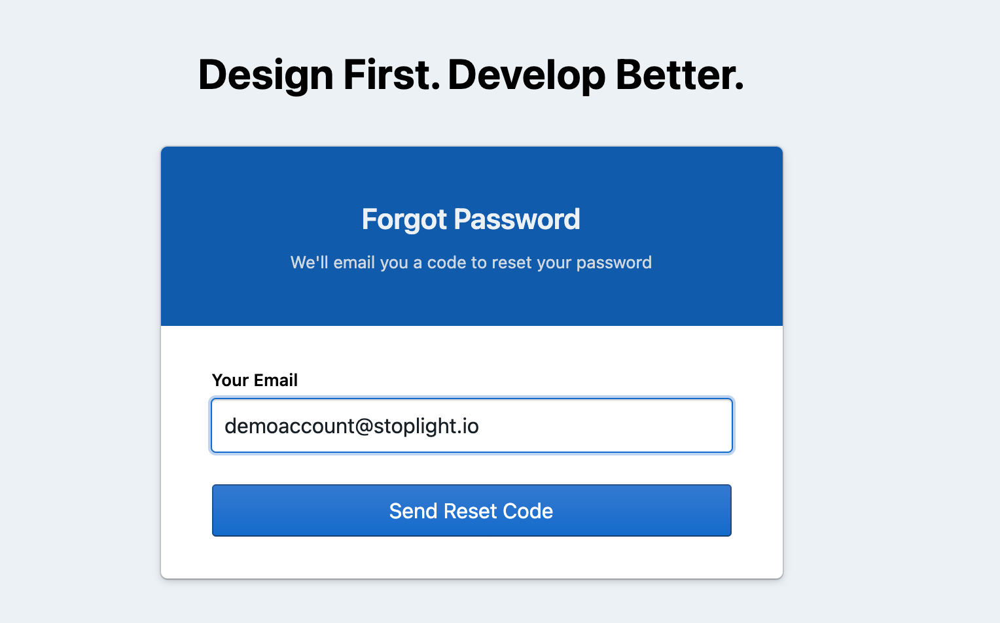
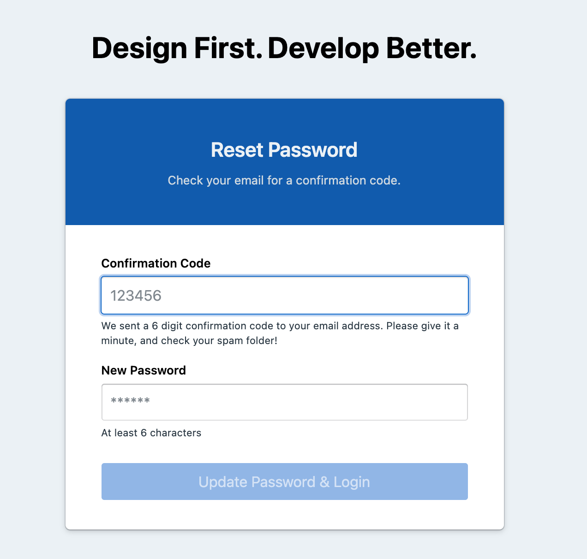

# Reset your account password   🔑

There are multiple ways to sign into your Stoplight account. If you prefer to sign in manually using your email address, you may need the password you created when you set up your account. In case you have forgotten your password or need to reset it, you can easily do it by following this guide. 

> 👉 **Note:** To reset your password, you must have access to the email address associated with your Stoplight account. If you no longer have access to the email address, get in touch with our team. 

## Update or Reset your password

1. Visit your workspace domain and click **Sign in**. 
2. Chose to login via email address. 
3. On the Login page, click forget password. 

4.  Enter the email address associated with your Stoplight account and click **Send Reset Code.** 

5. We will send you a confirmation code on your email address. Enter the **conformation code**, put in your **new password**, and click **Update Password and Login.** 

> 👉 **Tip:**  The new password you choose must be at least six characters long, and it can't be the same as your previous password.

6. Your Stoplight password has been updated. We urge you to keep your password safe in order to protect your organization's API assets. 

> 👉 **Note:** If you are unable to reset password or do not receive a reset password code, it might be because you are not a member of the workspace, or your account does not exist with that email address. If you are sure, you are entering the right details check your spam folder or contact our team. 

## Change Password

Additionally, if you are already logged into your account and want to change your password for some reason, you can visit [Account Settings](7.-account/account-settings.md) > Security to update your password. 

1. From your dashboard, on the bottom left, click your profile and select **Account Settings**. 

2. On the Account Settings page click **Security,** enter your **current password,** the **new password and** re-enter to confirm it. 

3. Click the **Update Password** button once you are done**.** 

**And that's it. You are good to go. Your account password is updated 🔐**