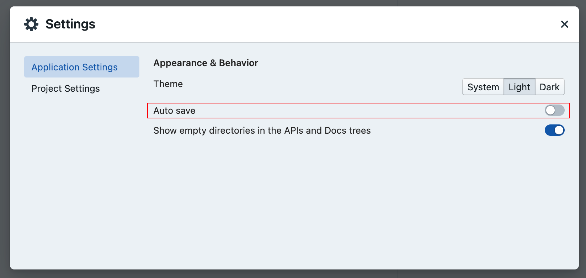
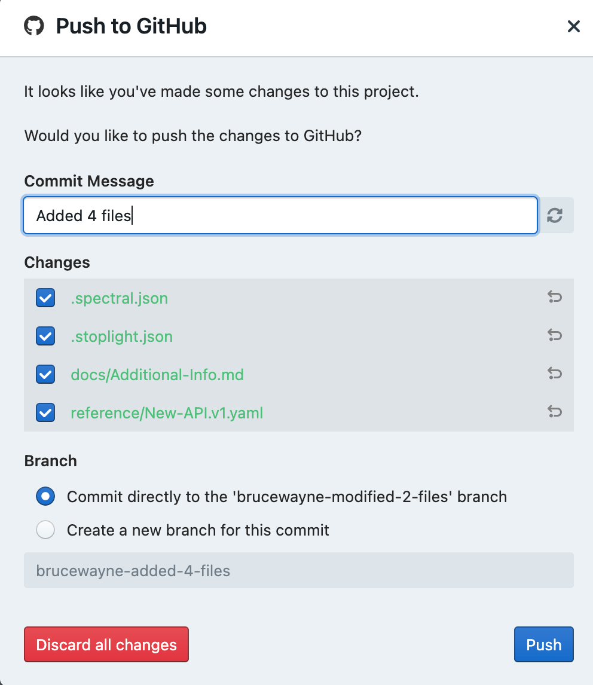
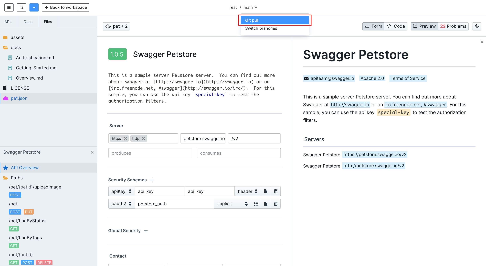
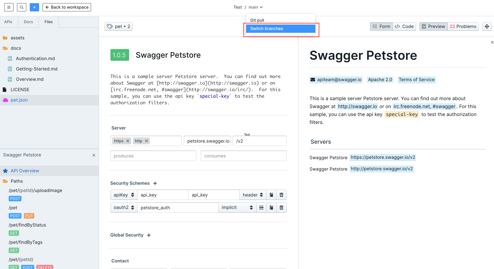
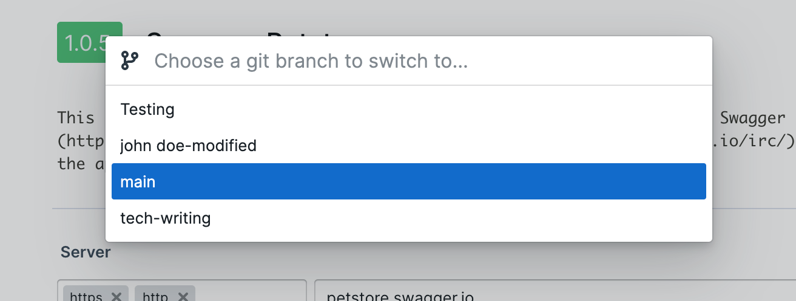
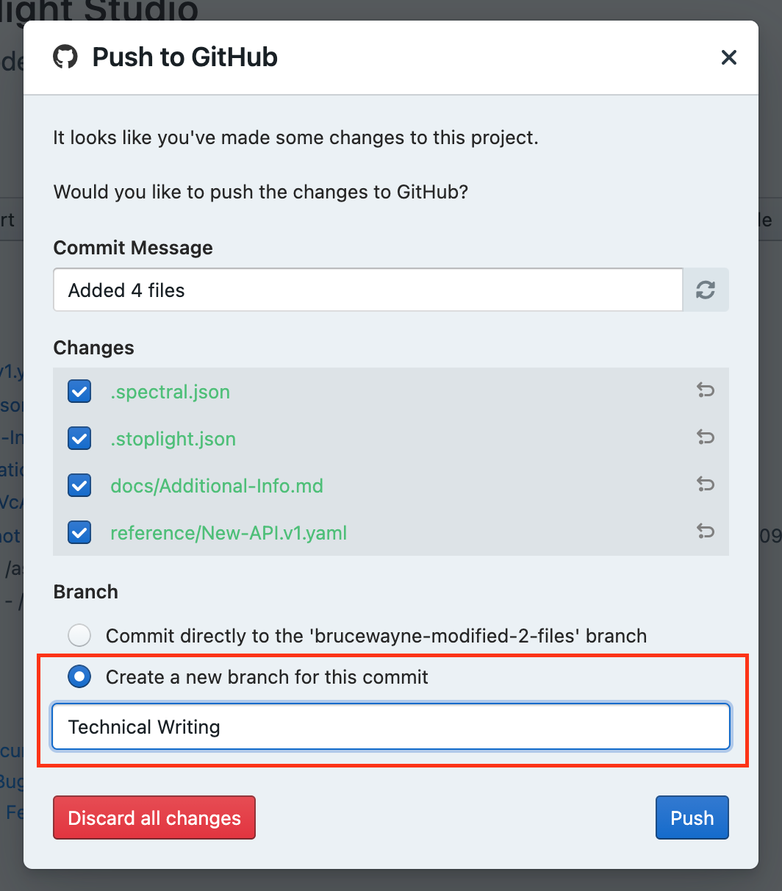
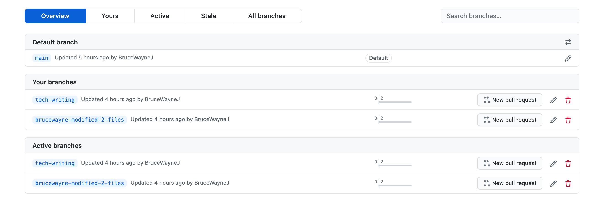

# ** Git Overview**

Stoplight works vis-à-vis with Git, and projects using Git as the source of truth have a bunch of extra functionality enabled. The platform has first-class support for common Git tasks like pushing, pulling, creating/switching branches, comparing differences, etc.

> **👉 Note:** To find out how to add projects from Git, or to push new projects to Git, read our guide: Adding Projects

## What is Git?

Git is a version control system which can help developers collaborate on a bunch of different things without clobbering each others work, or it can help just one developer keep track of various in-progress changes. 

At Stoplight we support multiple Git providers including: Github, Bitbucket, Gitlab, Gitea and Azure Devops. 

GitHub is one popular Git repository hosting provider of many. They have written a nice [introduction to Git](https://guides.github.com/introduction/git-handbook/) which you might want to check out if you're new to Git entirely.

> **👉 Note:** Learn how to configure Git with your projects on our **Configure git** guide**.** 

## Common Git commands

You don't need to know too much about the complexities of Git in order to get things done in Studio, but the following actions are worth knowing about.

## 1. Making changes

When working on files, you will want to save any changes you made to them in order to save your progress. However every single change you make, is not instantly pushed out to your online repos, because that would cause anarchy and lost work

Git has two concepts known as "**Commit**" and "**Push**". 

### **Commit:**

Committing is the act of staging a bunch of changes into a group of changes along with a commit message. 

Usually, any changes you make to your files, Stoplight auto saves them. You can disable that to manually save/commit these changes every time. 

### **Push:**

Pushing is uploading the changes from local storage to your Git repository. Commits can be pushed to your repo, as long as there are no conflicts. 

Studio will always ask you to push a commit, because non-pushed commits can sit around on your computer, unshared with others, and that can lead to confusion and lost work.

> **⚠️ Warning:** Be careful to not click that red discard button. Discarding all your changes will reset files back to how they were in the last commit, meaning even saved changes will be gone.

## 2. Pulling Changes

While Stoplight automatically pulls changes for projects connected to Git. If you'd want to reassure that you have the latest content from your repo, you can  click the **pull** button on top centre of the studio. 

This will immediately synchronize your workspace with the latest from your repo. 

This will update your local files, so you can continue working from where your or your team mates left from. 

## 3. Switching Branches

Git is a very open-ended technology which can be used in a lot of different ways. A common practice is to have multiple branches separate of your main brach, to avoid any sort conflicts while merging. 

A **branch** is essentially is a unique set of code changes with a unique name. Each repository can have one or more branches, where collaborators can work on, and then changes on those branches are eventually merged back into the main branch. 

The main branch — the one where all changes  get merged into, is called the **master.**

To switch branches. 

1. Click the **branch name** on top centre of your Studio page.  

2. From the modal box, that opens up, switch between your branches. 

3. To create a new branch, you will have to specify one when you are pushing changes to Git. 

4. When you click the **push** button, select **Create a new branch for this commit.** 

5. Specify the name of the **branch**, and then click **Push**. 

6. This will create a new branch in your repo. 

## **Using Other Clients**

If you already have a favorite Git client like [git cli](https://git-scm.com/docs/gitcli), [Github Desktop](https://desktop.github.com/), [Sourcetree](https://www.sourcetreeapp.com/), or similar, then you're very welcome to continue using them. You'll need to give Stoplight a reload (CMD + R / Ctrl + R) for now, then Studio will notice the changes and you're all set.