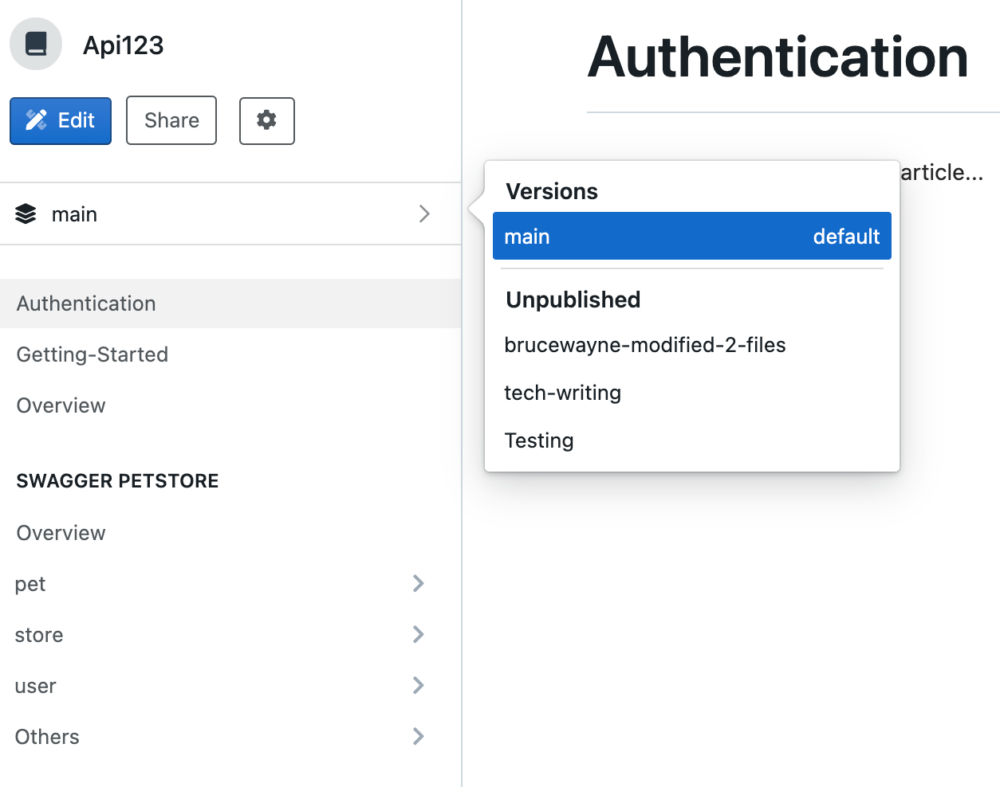
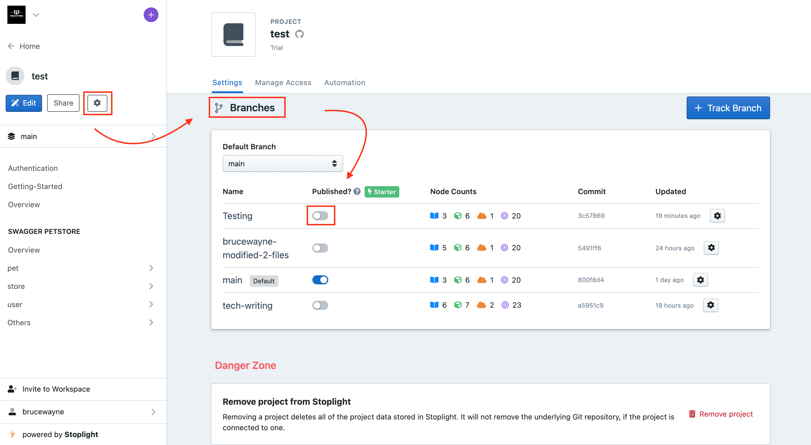
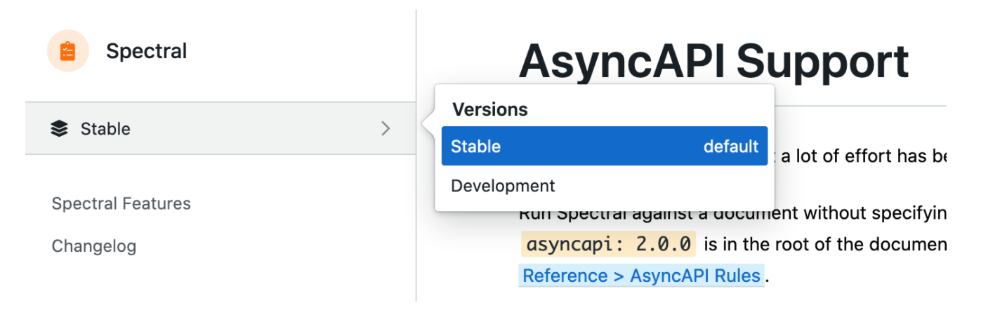
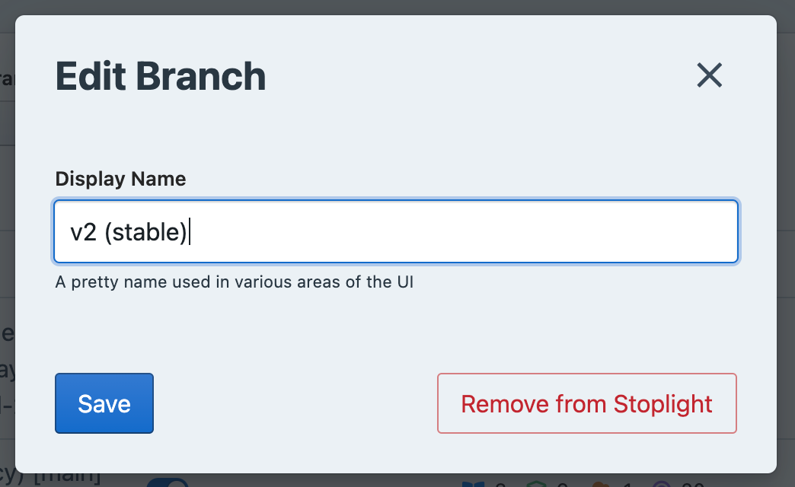
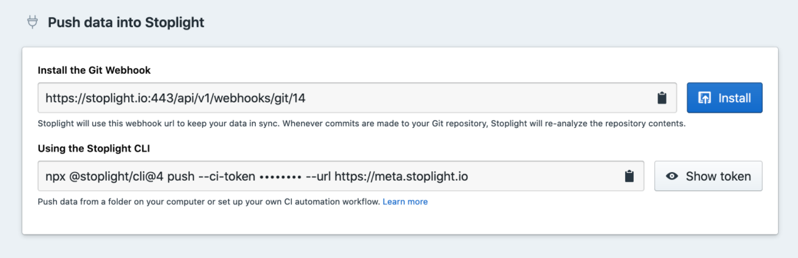
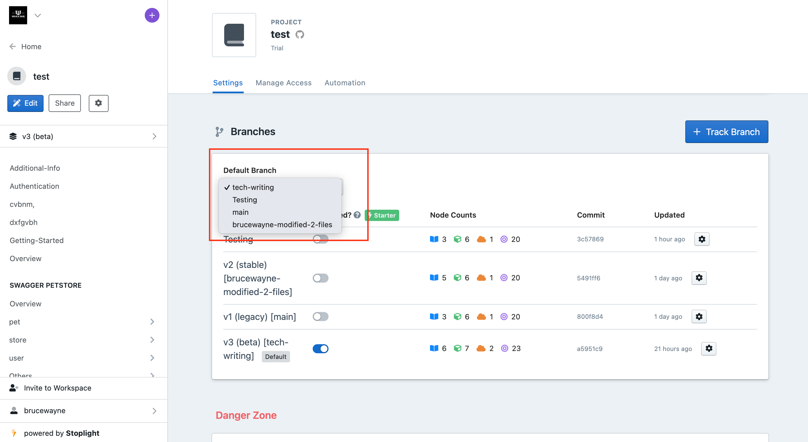
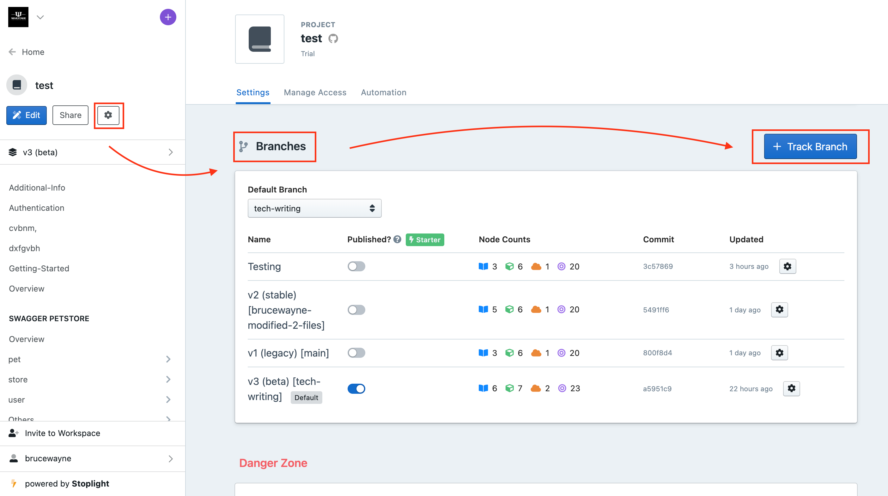
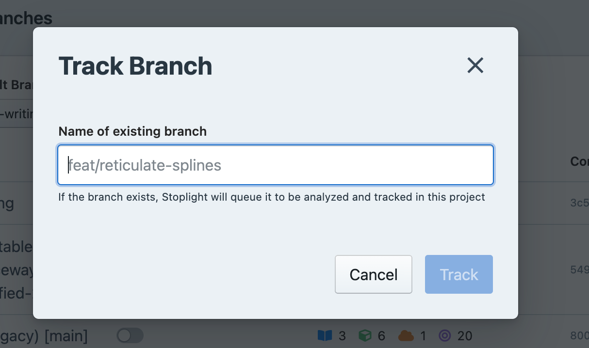
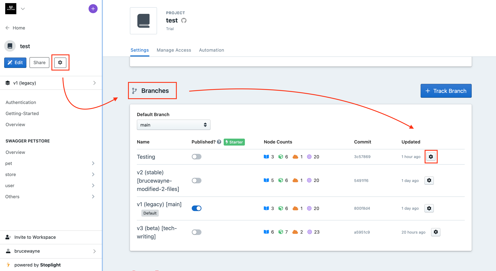
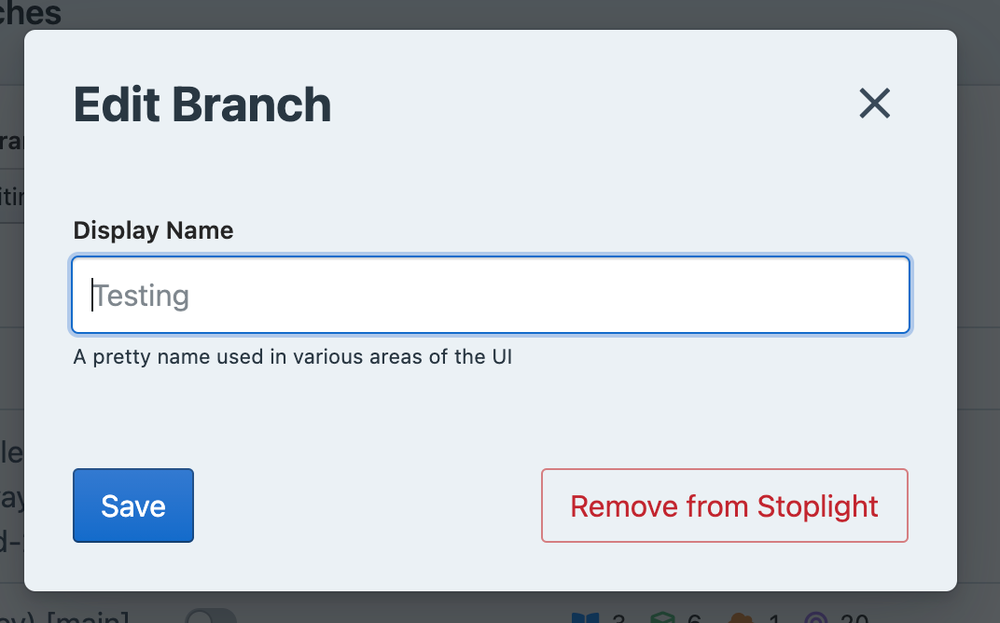

# Branch Management

Branch Management is one of the core basics of Git. Typically branches are used to work on new features, to avoid conflicts while merging. Stoplight projects powered by Git can leverage the awesome power of [Git branches](https://git-scm.com/book/en/v2/Git-Branching-Branches-in-a-Nutshell). Read on to learn how: 

## What are Branches?

A **branch** on Git is essentially is a unique set of changes with a unique name. You can use a branch to isolate development work without affecting other branches in the repository. 

**Git** allows for as many **branches** as you want, so you can think of master as the trunk that your work usually branches out from - just like a tree!

Usually branches follow certain "branching models" for common workflows such as [**Git Flow](https://www.atlassian.com/git/tutorials/comparing-workflows/gitflow-workflow).** 

These repositories will have a `master` and a `develop` branch, along with all sorts of "feature branches" in the format of `feature/adding-a-thing`.

Regardless of the model, there is always a default branch. Branches could be named absolutely anything, but there are some common default branch names used by most of the popular Git providers: `trunk`, `main`, or `master`.

## Working with Branches on Stoplight

You can have multiple branches for your projects on Stoplight vis-a-vis your Git project. 

When you add a **project from Git**, all your branches are synced with your Stoplight workspace. Whenever a new branch is added to your Git project, Stoplight will pull the branch whenever refreshed. 

### Before you start make sure:

- You have read and write access to your Git repo.
- Your projects is associated with a Git repo.

## 1. Switching Branches

Your project's **branches** are displayed on the bottom right of **Studio**. You can switch to a branch other than master anytime, to push/pull content according to your need. To switch branches: 

1. From your dashboard, navigate to your **project** and click **edit** to open **Studio**. 
2. On bottom right of your **Studio** home screen, click the branch name, next to the Git icon. 

**Note:** Your main branch will always be chosen by default.

2. Chose a branch from the list that opens. 

3. In case you want to create a new branch, you will have to specify when you are **pushing changes to git.** 

## 2. Publishing Branches

Whenever you make changes to your APIs, whether done in Stoplight Studio or anywhere else, you would want those changes reflected everywhere throughout your project.

The [**publishing process](https://meta.stoplight.io/docs/platform/2.-workspaces/g.automating-publishing.md)**  for these changes is automatically enabled for the **default branch**. When the **default branch** is published it updates all sorts of things including: Explorer, Documentation, Mock Servers, and Design Library.

For branches other than your **default branch**, you will have to **manually configure publishing.** 

> **👉 Note**: This feature is only available on the Stoplight Starter plan, and above.

Both the **published** and **unpublished** branches will show in your documentation, and your team members can switch between versions using a dropdown. The explorer, mock servers, and the design library will only show content for the **published branches**. 

> **👉 Tip:** Branches is how you manage different versions of **documentation** on Stoplight. 

One use-case for **unpublished branches** is checking how documentation looks in a Pull Request before merging it. If you do **[API Design Reviews](https://meta.stoplight.io/docs/platform/3.-design/c.reviewing-your-api-design.md)**, unpublished branches would be part of that process.

> **👉 Note:** It's important to keep in mind that external **viewers** and **guests** can only see documentation **for published branches.** 

- **Published branches** (called "Versions") are viewable to everyone including Guest and Viewer roles.
- **Unpublished branches** are only viewable to workspace Makers, Admins, and Owners.

To mark a branch as published:

1. Go to **project** settings. 
2. Scroll down to **Branches**. 
3. Switch the toggle button next to **branch** name to publish. 

## 3. Renaming Branches

You can rename branches for better recognizability, but renaming branches on Stoplight does not change their name on your Git repo. Think of it like an alias. 

Doing this can make things more clear for end-users of your APIs who might not be familiar with your internal branching model or workflow.

For example, if you are using Git Flow, you could name your branches this:

**Git:** master → **Stoplight:** Stable

**Git:** develop ****→ **Stoplight: Development

This is how it would look like. 

This can help with versioning your documentation as well.  For instance, when putting out a new version of documentation on a new branch, you can advertise which version should the viewers be looking at without having to change the name of your Git branches. 

**Git:** v4→ **Stoplight:** v4 (legacy)

**Git:** v5 ****→ **Stoplight:** v5 (stable)

**Git:** v6 ****→ **Stoplight:** v6 (beta)

Maybe the v5 branch is marked as stable, then when v6 is deployed ti production the default is changed.

To rename branches on stoplight: 

1. Go to **project** settings. 
2. Scroll down to **branches**. 
3. Click on the **settings** icon in the same row as the branch you want to rename. 

4. Enter in your desired **Display Name** and click S**ave.** 

## 4. Changing Default Branches

Incase you want to switch your default branch, for example from `master` to `main` , you can easily do this in Studio or via the CLI for the locally cloned repositories.

1. Run this command in the terminal to push the master branch up, but give it a new name: `main`.

     `git push origin master:main` git push origin :master

2. Now we have two probably identical branches. Pop over to your project settings to change it.

3. Change the default branch using the dropdown on project settings page. Once you do that you should see a message letting you know the default branch was updated successfully.

4. You will probably need to update your default branch on your repository too:

- [GitHub Cloud Instructions](https://docs.github.com/en/github/administering-a-repository/setting-the-default-branch)
- [GitHub Enterprise Instructions](https://docs.github.com/en/enterprise/2.21/user/github/administering-a-repository/setting-the-default-branch)
- [GitLab Cloud Instructions](https://docs.gitlab.com/ee/user/project/repository/branches/)
- [GitLab Server Instructions](https://docs.gitlab.com/ee/user/project/repository/branches/#default-branch)

5. Remove the old branch from your Git repository.

`git push origin master`

6. If [webhooks](https://meta.stoplight.io/docs/platform/2.-workspaces/g.automating-publishing.md) have been setup then this branch has already been automatically removed from Stoplight. If webhooks are not enabled, you will need to delete the branch from the list by clicking on the cog and clicking the "Remove from Stoplight" button.

## 5. Track Branches

Stoplight automatically **tracks** your default branch and all branches associated with a pull request. 

If you want to track Git branches that are not associated with a pull request, such as a development or version branch, you can easily configure that to be done.  

Tracking a Git branch will analyze it, and add it to your list of branches in Stoplight.

This won't create a new Git branch, it's just going to tell Stoplight to keep an eye out for webhooks mentioning a branch of that name.

To track a branch not associated with pull request:

1. Go to **project** settings. 
2. Scroll down to **branches**. 
3. Click **Track Branch,** this will open a modal**.** 

4. In the modal, add **name** of the branch, and click **Track.** 

**6. Remove Branch**

Incase you want to remove a branch from your Stoplight project, you can easily do that as well. Removing a branch from stoplight does not remove it from **Git**. 

Once you've removed a **branch**, you can add it back using the **Track Branch** functionality. To remove a branch: 

1. Go to **project** settings. 
2. Scroll down to **branches**. 
3. Click on the **settings** icon in the same row as the branch you want to remove.  

4. Click the **Remove from Stoplight button**. 

**Congrats!** **You now know how to work with branches on Stoplight! 🌲**

## What's Next?

Knowing how to structure your projects and manage your workflows is very crucial. Once you are comfortable with the process, read on to learn the next steps: 

- **[Making Documentation Public](1.-quickstarts/share-documentation-quickstart.md)**
- **[Publishing Changes](../2.-workspaces/publish-changes.md)**
