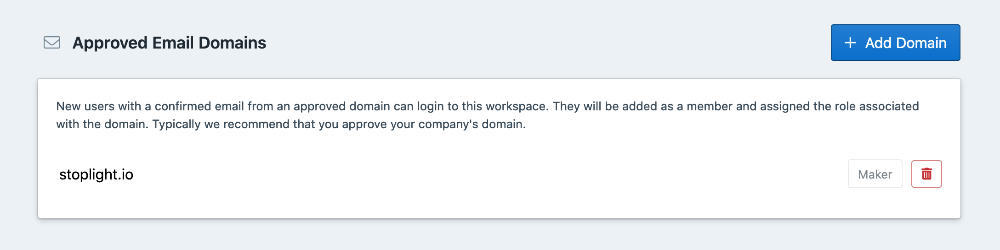

# Allowed Email Domains

Inviting and managing team members in large teams can become a cumbersome process, but you can simply that by approving an entire **domain**.  

This way anyone with an email for the domain will be automatically approved with whatever default permissions are configured.

## Making Your Workspace Discoverable

1. On the member settings page, click **Add Domain.** 
2. Enter the domain you want to approve e.g. "[yourcompany.com](http://yourcompany.com/)" and select the default role for members signing up. You can change their roles later. The recommended role would be a viewer or maker.

**👉 Note:** This feature is included with the **Starter Plan** and **up.**